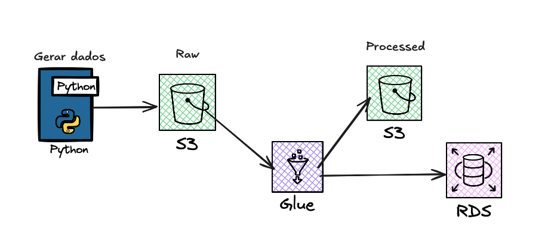

# Infraestrutura AWS - Teste Técnico Letrus

Este projeto provisiona uma infraestrutura completa na AWS para pipelines de dados, incluindo:

- **S3 Buckets**: Armazenamento de dados brutos e transformados (✅ FREE TIER)
- **RDS PostgreSQL**: Banco de dados gerenciado (✅ FREE TIER: db.t3.micro, 20GB)
- **AWS Glue**: Jobs e Crawlers para processamento de dados (otimizado: 0.5 DPU)
- **Bastion Host**: EC2 para acesso seguro ao RDS (✅ FREE TIER: t3.micro)
- **VPC**: 2 AZs, 1 NAT Gateway, VPC Endpoint S3 (otimizado para dev)
- **IAM**: Roles e políticas com princípio de menor privilégio

## Arquitetura



## Estrutura do Projeto

```
.
├── modules/              # Módulos Terraform
│   ├── s3/              # Buckets S3 (raw, processed, scripts)
│   ├── aurora/          # Aurora PostgreSQL cluster
│   ├── glue/            # Glue Jobs e Crawlers
│   ├── iam/             # IAM Roles e Policies
│   ├── vpc/             # VPC e subnets
│   └── bastion/         # Bastion Host para acesso ao Aurora
├── scripts/             # Scripts Python e Bash
│   ├── glue_jobs/       # Scripts Glue e SQL
│   │   ├── etl_pipeline.py
│   │   ├── create_rds_tables.sql      # ✅ Renomeado de create_aurora_tables.sql
│   │   └── analytics_queries.sql
│   ├── generate_synthetic_data.py
│   ├── upload_to_s3.py
│   ├── run_pipeline.sh
│   └── create_rds_tables.sh           # ✅ Renomeado de create_aurora_tables.sh
├── main.tf              # Configuração principal
├── variables.tf         # Variáveis
├── outputs.tf           # Outputs
├── terraform.tfvars            # Valores das variáveis (não versionado)
├── FREE_TIER_OPTIMIZATION.md   # 🎯 Otimização Free Tier e custos mínimos
├── COST_OPTIMIZATION.md        # Otimização de VPC (AZs e NAT)
├── ANALYTICS_GUIDE.md          # Guia de queries analíticas
└── README.md                   # Este arquivo
```

## 💰 Otimização de Custos

Este projeto implementa **otimização AGRESSIVA para FREE TIER e custos mínimos**:

### 🎯 Otimização Free Tier (Atual)
| Item | Configuração | Status |
|------|--------------|--------|
| **RDS** | db.t3.micro, 20GB | ✅ FREE TIER |
| **Bastion** | EC2 t3.micro | ✅ FREE TIER |
| **S3** | <5GB, lifecycle agressivo | ✅ FREE TIER |
| **Glue** | 2 DPU (2 × G.1X) | Otimizado |
| **VPC Endpoint S3** | Gateway | ✅ GRÁTIS |
| **Custo Total** | ~$35-50/mês | **60-70% economia** |

📖 **[Veja detalhes completos em FREE_TIER_OPTIMIZATION.md](FREE_TIER_OPTIMIZATION.md)**

### 🏗️ Otimização VPC por Ambiente
| Ambiente | AZs | NAT Gateways | Custo VPC/mês |
|----------|-----|--------------|---------------|
| **Dev** | 2 | 1 | ~$35 |
| **Prod** | 3 | 3 | ~$100 |

📖 **[Veja detalhes em COST_OPTIMIZATION.md](COST_OPTIMIZATION.md)**

**✅ Economia anual estimada em dev: ~$1,392**

Para detalhes completos sobre as otimizações, veja **[COST_OPTIMIZATION.md](COST_OPTIMIZATION.md)**

## Pré-requisitos

- Terraform >= 1.0
- AWS CLI configurado
- Credenciais AWS configuradas (via AWS CLI, variáveis de ambiente ou IAM Role)

## Configuração Inicial

### 1. Clone o repositório

### 2. Configure as variáveis do Terraform

```bash
cp terraform.tfvars.example terraform.tfvars
```

Edite `terraform.tfvars` com suas configurações específicas.

### 3. Provisione a infraestrutura

```bash
# Inicialize o Terraform
terraform init

# Revise o plano de execução
terraform plan

# Aplique a infraestrutura
terraform apply
```

### 4. Gere dados sintéticos

```bash
# Gerar datasets de exemplo
python scripts/generate_synthetic_data.py

# Fazer upload para S3
python scripts/upload_to_s3.py
```

### 5. Execute o pipeline ETL completo

```bash
./scripts/run_pipeline.sh
```

Este script automaticamente:
- Faz upload do script Glue para S3
- Cria tabelas no Aurora (via Bastion Host se necessário)
- Verifica dados no S3 Raw
- Executa o Glue Job
- Monitora a execução em tempo real

**Nota**: Se o Aurora estiver em subnet privada, você precisará criar as tabelas manualmente via Bastion Host:

```bash
# Opção 1: Script automático
./scripts/create_aurora_tables.sh

# Opção 2: Manual
# Terminal 1: Abrir tunnel SSH
./connect-aurora-alt.sh

# Terminal 2: Criar tabelas
psql -h localhost -p 15432 -U masteruser -d datawarehouse \
  -f scripts/glue_jobs/create_aurora_tables.sql
```


## Scripts Disponíveis

| Script | Descrição |
|--------|-----------|
| `generate_synthetic_data.py` | Gera datasets sintéticos (escolas, alunos, notas) |
| `upload_to_s3.py` | Faz upload dos dados para S3 Raw |
| `run_pipeline.sh` | Executa o pipeline ETL completo (setup + job + monitoramento) |
| `create_aurora_tables.sh` | Cria tabelas no Aurora via tunnel SSH |
| `connect-aurora-alt.sh` | Abre tunnel SSH para Aurora (porta 15432) |
| `etl_pipeline.py` | Job Glue que processa dados e carrega no Aurora |
| `analytics_queries.sql` | Queries analíticas para análise de dados |
| `COST_OPTIMIZATION.md` | Documentação completa de otimização de custos |

## Limpeza

Para destruir toda a infraestrutura:

```bash
# Esvaziar buckets S3 primeiro
aws s3 rm s3://case-tec-dev-raw-letrus --recursive
aws s3 rm s3://case-tec-dev-processed-letrus --recursive
aws s3 rm s3://case-tec-dev-scripts-letrus --recursive

# Destruir infraestrutura
terraform destroy
```

